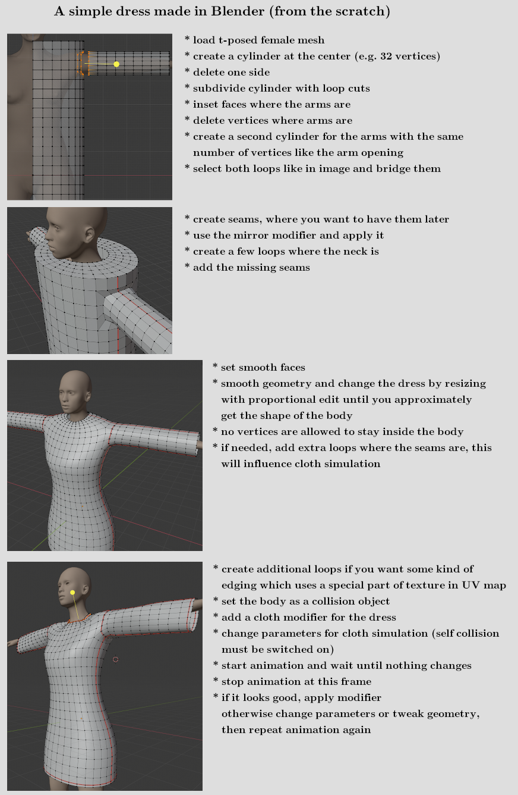
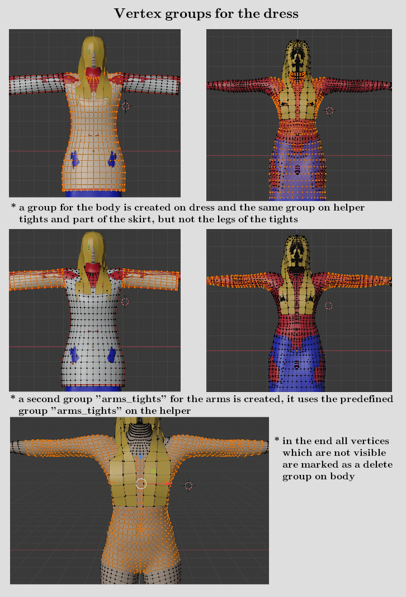
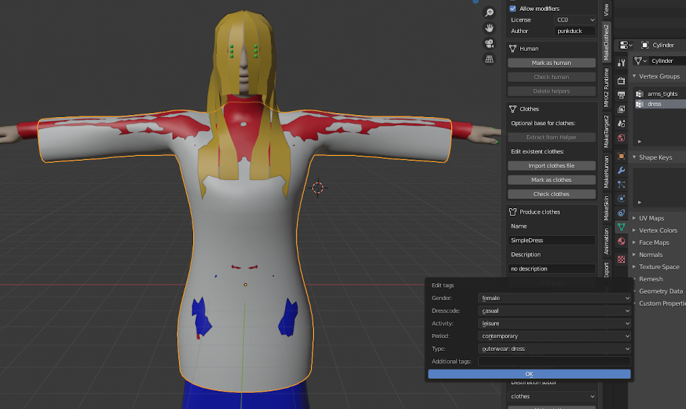
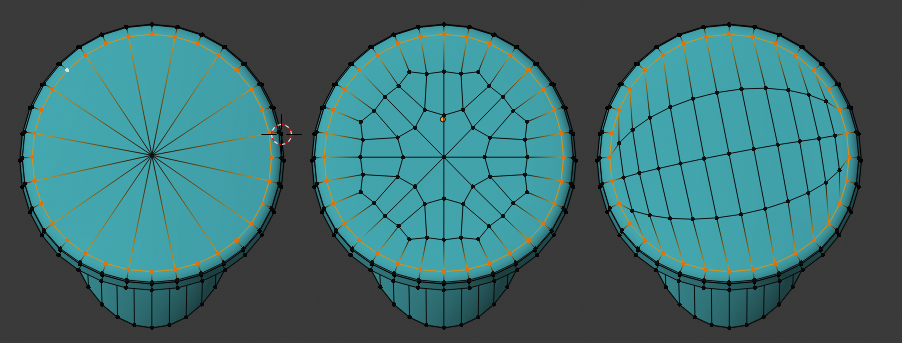
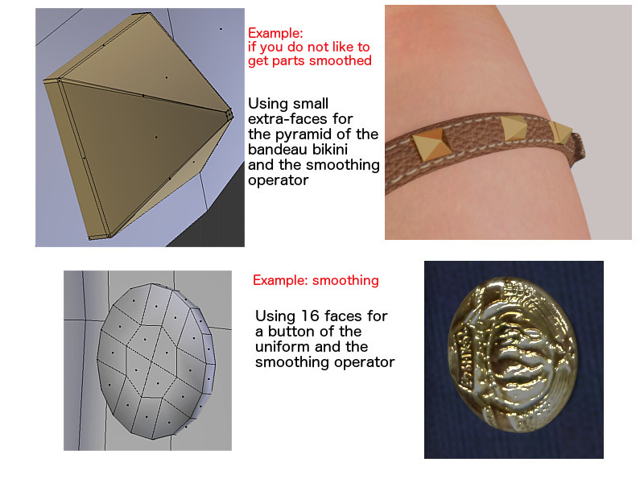
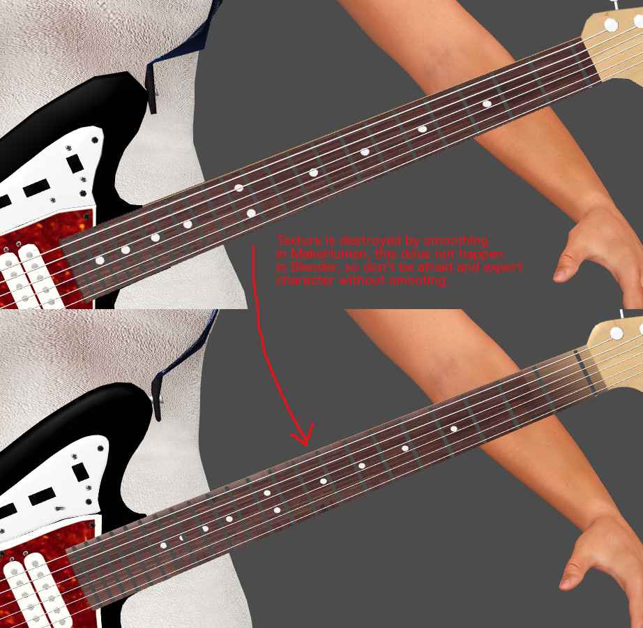
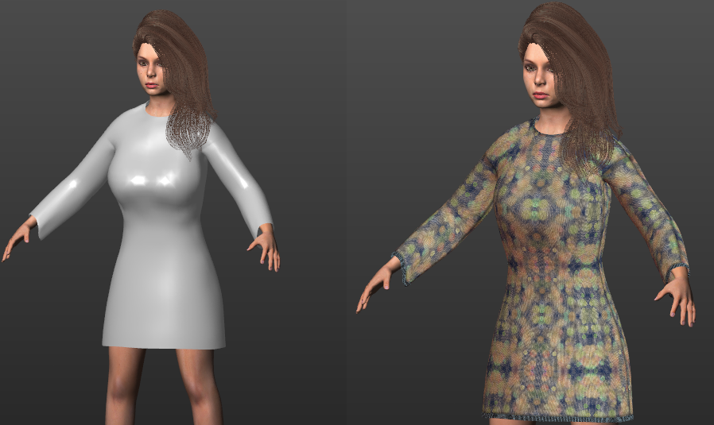
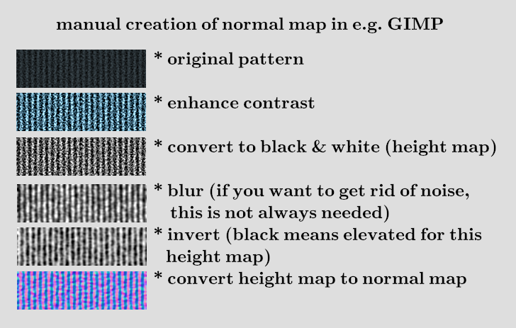
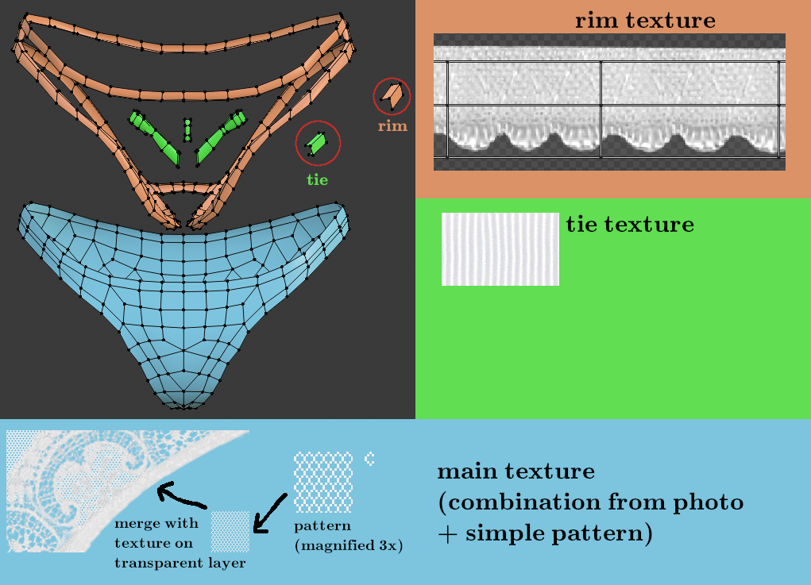

## Creating a dress from the scratch

There are a lot of ways to model a piece of cloth. There is also 3rd party software available, where it is possible to model clothes like a tailor does. Here is one way to create it with simple elements and then use Blender cloth simulation.
To show an easy way, the work is done with a t-pose female mesh (with and without helper), so this time not the standard MakeHuman pose is used. These t-posed meshes are included in MakeClothes.

We only use cylinders, inset faces, extruding, loop cuts and edge bridging. Therefore we will have quads in the end. Furthermore this dress is made without lose geometry (all vertices are connected). So it can be used in a cloth simulation directly. This is not necessarily needed, at the end of this document I added an example with a mesh using lose geometry 

Now the mesh must be UV-unwrapped. For some tips and tricks just read the next chapter about texturing.

After modeling the dress the vertex groups must be assigned. Therefore the female mesh without helper is deleted and the predefined one with helpers is loaded with MakeClothes.

Then all missing parameters are supplied and the dress is ready to go, but without texture.

### Maximum number of poles

The newest version of MakeHuman is able to handle also bigger number of poles. But especially quad-meshes with a high number of poles are not very good for subdivision. A high number of poles often appears, when a disc (with even number of vertices) must be filled.

This can be easily avoided. The example shows 3 methods of a 32 vertices circle to do it:

# left: select the yellow circle, use checker deselect to select every second vertex, extrude to center and press CTRL m to connect all vertices. This results is a pole of 16, which is not good.
# middle: do it manually by connecting some of them according to the pattern. This results in a regular pattern of only 8 poles in the middle
# right: use grid fill, the easiest method which will not have more then 4 poles. Only one tiny disadvantage: if you need the middle (e.g. to be elevated) this might be less accurate

### Sharp edges

MakeHuman normally saves files with smooth faces for import in Blender. When smoothing in MakeHuman or Blender is switched on, all geometry is smoothed. For most of the geometry (for clothes) this works as desired. But there are some exceptions where a sharp edge is needed. The demo-picture shows one example for a smooth surface (the button) and one for a sharp edge. For the sharp edge tiny faces at the edges are needed. Further information: be aware that both geometries in this example should have an own vertex group made from 3 vertices on body or helper not to be distorted. Very small geometry will be distorted when two vertices, which are very near, correspond to different vertex-combinations on the base mesh.

Further hint: MakeHuman's algorithm for subdivision-surface does not work correctly for textures. The geometry is smoothed but the texture coordinates are also distributed in the same ratio. This results in a wrong representation of the texture especially when small and large faces join a common edge. Blender is able to use a mode with correct UV representation.

## Texturing the clothes

For the example we use a texture which is not created inside Blender with e.g. perspective painting. We use GIMP (or any other paint program) to create png-Files.

When the dress appears in MakeHuman it looked like the one on the left side. Result should be the one of the right side.

To have a base for a paint program the layout of the UV-Map must be exported. Depending on the details and to get a visible structure a minimum size of 2048x2048 is chosen.
When you create parts which are used multiple times (like buttons), you should UV-unwrap this geometry before you copy it. The copy of the texture will then be on the same position.

Sometimes it makes sense to align some of the unwrapped geometry, in the example we do that for the edges and sleeves. There are Blender tools to support this in the UV-map.

In the paint program we need a seamless texture (which can be repeated without visible seams). This can be created by a function inside the paint program or by mirroring.

In the example mirroring was used. The texture is inserted in an extra layer. The plane was simply filled with the pattern, the black mask is added in a third layer for clarification. Side effect of the black mask is that the file becomes a little shorter.

In the end we will supply a normalmap, which is created by the paint program and not in Blender. In this case we need to do a height map first. If we use a black and white image white means low and black means high. If the software works the other way round, just the inverted image is needed. This following steps are done for the edges of the dress.

### Lose geometry and transparent textures

Finally I will add an example how a simple mesh (657 vertices) will create a rather realistic looking piece of cloth. This mesh stays close to the body and because of lose geometry cannot be used for a cloth simulation directly (it will fall apart). Furthermode the rims intersect with the body to simulate a close fit. For a cloth simulation with the body as a collision object this will give unpredictable results.

I marked the elements of the lingerie with 3 colors:

# blue for the main part
# orange for the rims
# green for the bow tie

The blue part was modeled directly on the body (one half) and then mirrored. The rims were separated and then extruded in z direction. Second extrude was made so that the resulting vertices are inside the body. The bow tie was "painted" with a single vertex by extruding a "curve" in x-z plane. Then this was extruded in y direction and changed to a u-shape.

All 3 elements use different parts of the texture. It makes sense to align the rim and put the texture on a special part which then is repeated. Same for the bow tie. The rest is a normal UV-unwrap. Seams are at the sides and in crotch area (identical to reality). To get the very fine structure I manually created a hexagon mesh, used it as a fill pattern and combined that with the rest of the texture.

This is the result (using a diffuse and normal map):

