**2.0-alpha1 was released 2022-03-06**

As 2.0-alpha1 is the first release in the MPFB2 series, the following are changes since MPFB1.

Before installing MPFB2, you should take a look at the [known issues](#known-issues) section at the bottom of this page.

## Downloads

The 2.0-alpha1 build of MPFB can be downloaded from [Tuxfamily](https://download.tuxfamily.org/makehuman/releases/mpfb-2.0.0-a1.zip).

If this is the first time you install MPFB2, you might want to take a look at the [Getting started]() guide.

## New features in summary

* MODEL: There is a one-click-create functionality for quickly setting up a basic humanoid mesh
* MODEL: Modeling of the body shape can be done directly in blender
* MODEL: MHM files can be opened directly in blender, as an alternative to the online import functionality from MakeHuman
* MODEL: When creating characters in blender, targets are added as shape keys (earlier, you got a baked mesh with all shapes applied)
* ASSETS: Clothes, proxies, hair, rigs and other assets can be added to the character in blender. The assets are listed in an asset library in the UI.
* MATERIALS: There is a new procedural eye material
* RIGGING: There is a one-click-add functionality for adding a rigify meta rig to a character, and a button for then generating the final rigify rig. _**This is an experimental feature**_.
* RIGGING: There is a new IK helper setup with support for finger/hand/arm/foot/leg/eyes IK.
* RIGGING: Poses can be stored as presets which can then be applied to other characters
* CODING: The codebase has been rewritten from scratch to make it more extensible and future-proof.
* CODING: Large parts of the codebase can be used as an API by other third party addons

## One-click-create humanoid mesh

You can quickly create a new humanoid mesh on the "New Human" -> "From scratch" panel. Basic phenotype features can be set. They can then later be modified dynamically on the created mesh.

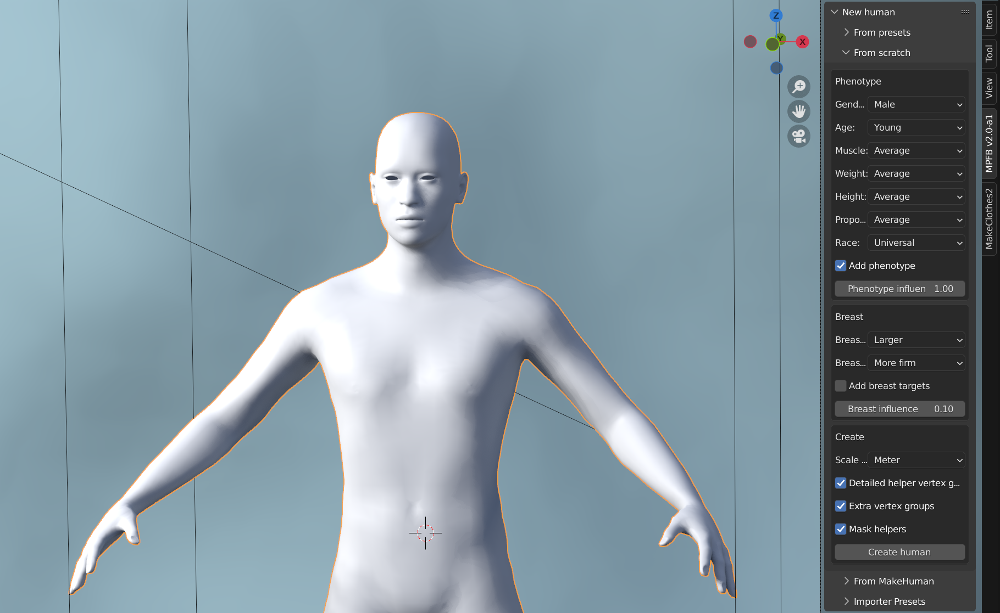

## Parametric modling directly in Blender

All features of the body can be modeled using parametric settings. The changes are reflected dynamically and continuously in the viewport.

## Open MHM files 

If you have characters modeled in MakeHuman, you can easily load these in Blender by simply opening the MHM file.

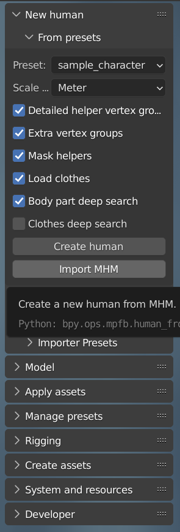

## All parametric settings are stored as shape keys

Rather than providing a static mesh, all parametric settings are stored as shape keys.

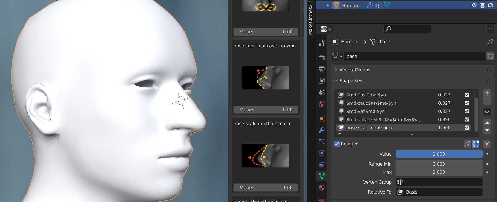

## Assets can be dynamically loaded from an asset library

Assets such as skin, eyes and clothes can be loaded dynamically from an asset library. 

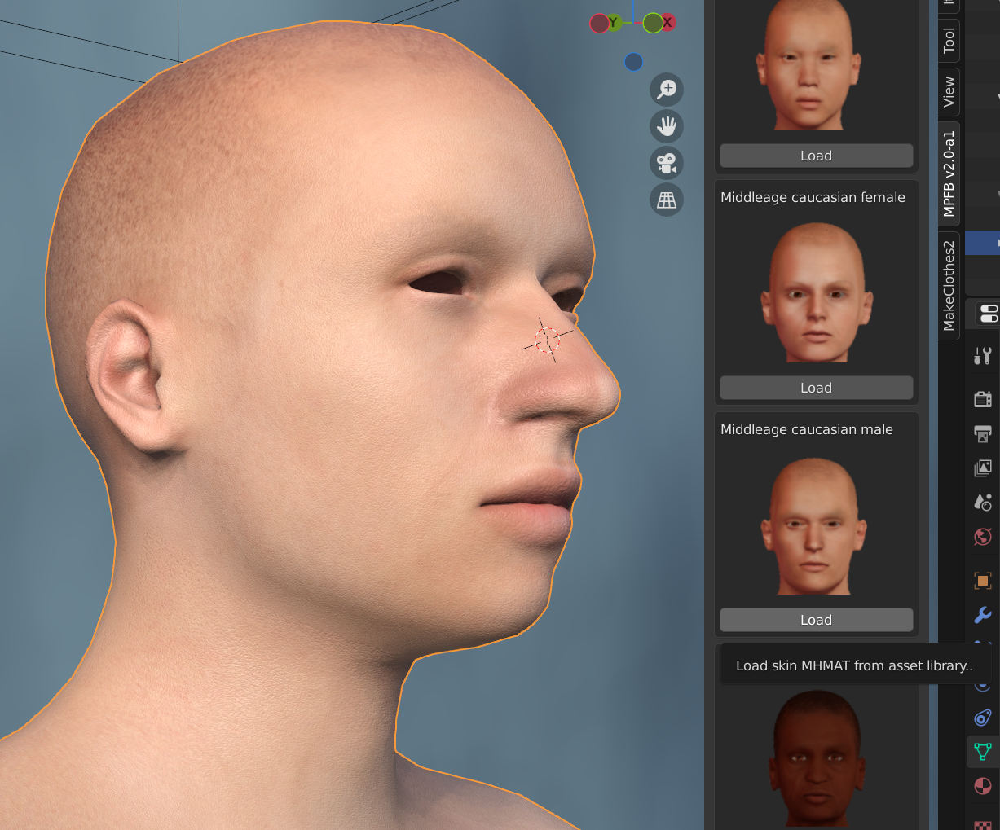

## The new procedural eye shader

There is a new and configurable procedural eye shader.

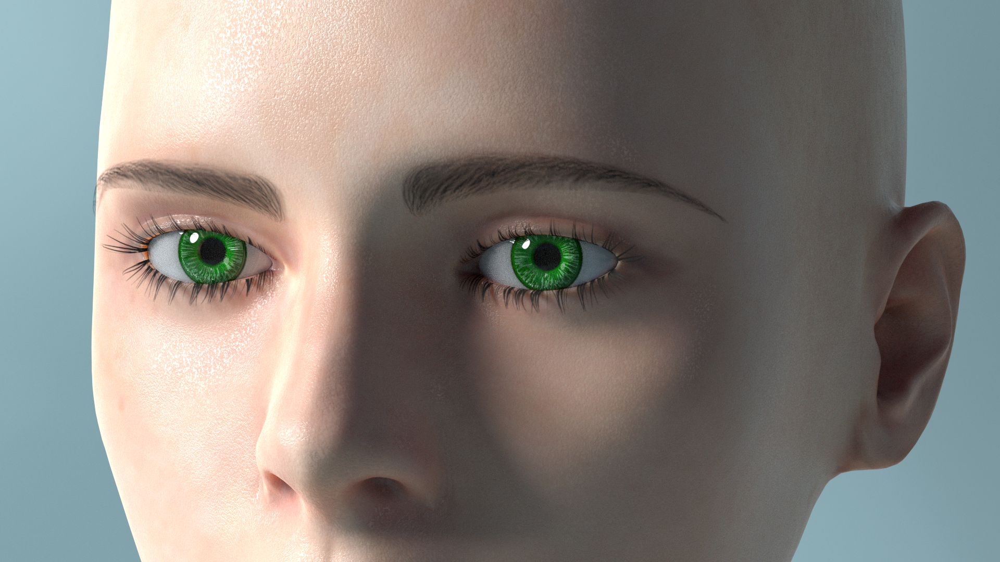

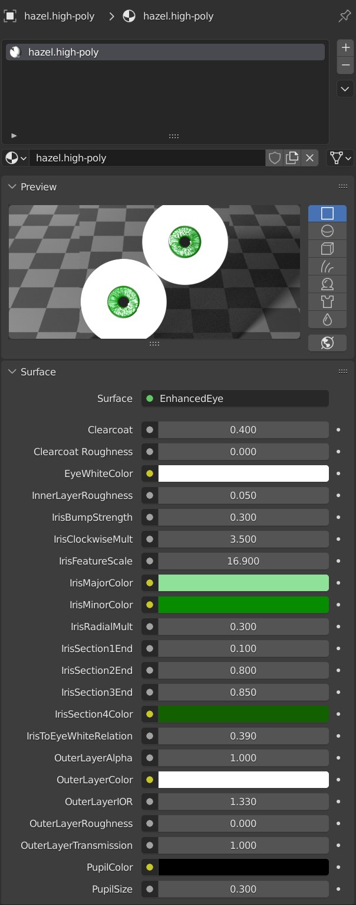

## Support for rigify meta rigs

A new rigify meta-rig can be added, with weights, to a humanoid mesh. It will be automatically fitted to the body shape. It can then be generated to a final rigify rig.

Before using this, you should read the "known issues" section at the bottom of this page, as the rigify functionality is not altogether stable.

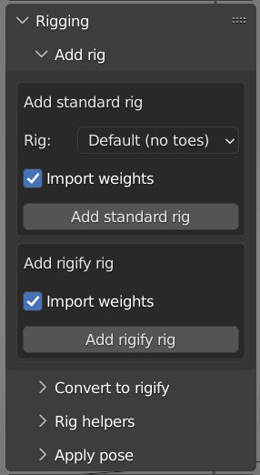

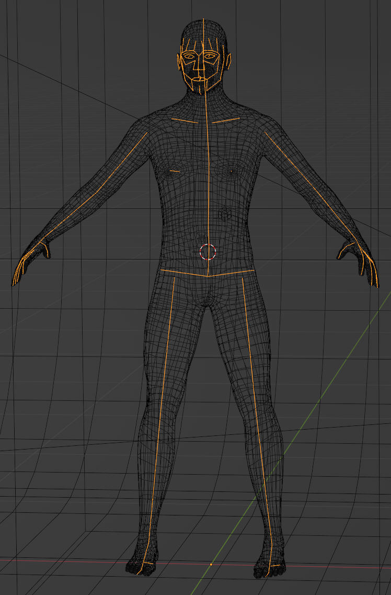

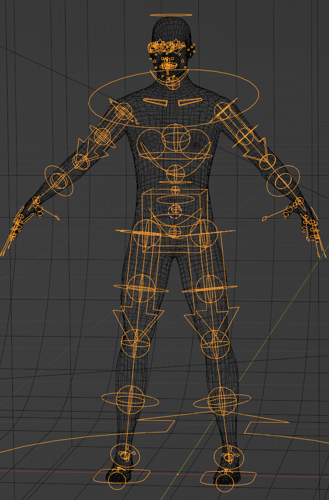

## New IK helpers

The default / default-no-toes rigs have support for IK helpers, enabling IK control of fingers, hands, feet and eyes.

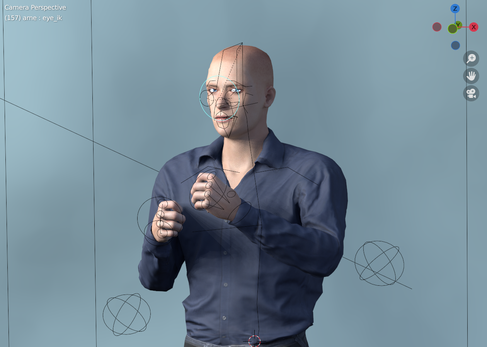

## Poses can be stored

Poses can be stored in the library and then be reused for multiple characters. The pose loading system will take character size and shape into account when 
loading a pose which wasn't originally made for it.

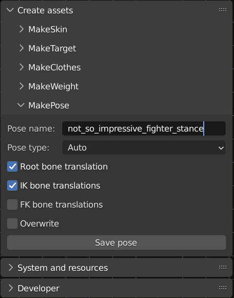 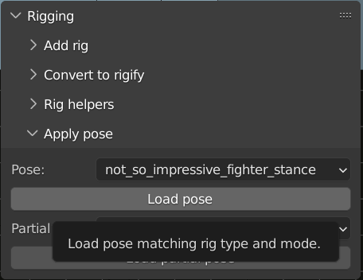

## The code base has been rewritten from scratch

The code base has been restructured to be more extensible and future proof. Further, one primary design goal has been to enable third party addons to use MPFB as an API.

Thus, creating a new human mesh in your own addon is as easy as:

    from mpfb.services.humanservice import HumanService
    basemesh_object = HumanService.create_human()
    
Most of the functionality available in the UI is implemented via these generic stateless services, enabling outside re-use.

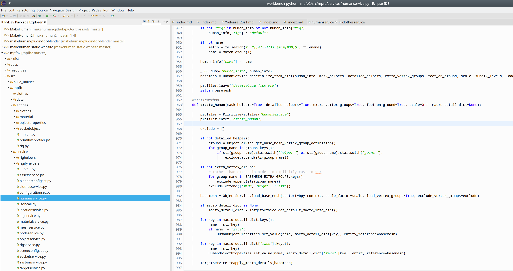

## Known issues

While much of the functionality in MPFB2 is in principle finished and working, some parts are still a bit rough around the edges. It is important to be aware of this
to have a reasonable idea of what to expect from the addon.

Especially the following areas will need more work before being considered stable:

### Rigify

The rigify code is highly experimental and known to sometimes produce strange results. The weight painting is crude, bone sizes ends up looking strange, teeth and eyes object have crude 
workarounds. If it works for you, all is well. However, you should not be surprised if the rigify functionality does not work as desired. If you want to participate in the bug reporting, see
the following issues on the bug tracker:

* [MPFB issues with Rigify 3.1 features bug](https://github.com/makehumancommunity/mpfb2/issues/21)
* [Some models do not import correctly when importing via "Import MHM"](https://github.com/makehumancommunity/mpfb2/issues/20)
* [MPFB should check if a name is already taken before using it in rigify generate](https://github.com/makehumancommunity/mpfb2/issues/17)
* [Rigify generated rig does not move lower jaw teeth](https://github.com/makehumancommunity/mpfb2/issues/10)
* [The rigify meta rig needs to be weight painted](https://github.com/makehumancommunity/mpfb2/issues/9)
* [4 Problems I found when adding Rigify Rig bug](https://github.com/makehumancommunity/mpfb2/issues/6)

If you happen to know your way around the rigify API and have some spare time, help would be much appreciated with getting the rigify functionality up to par.

### Poses

Something is wrong with IK poses. FK poses usually just work. However, for IK sometimes the spine gets twisted or other strange artifacts arise.

Further, there is no import or integration for MakeHuman style BVH poses and expressions. So these cannot be used at all in MPFB atm.

### MakeClothes port not really started

In the longer run, all the asset creation tools (MakeClothes, MakeSkin, MakeTarget...) will be merged with MPFB2. MakeSkin and MakeTarget have already
been ported, but the port of MakeClothes has hardly even started. The only actually working part of it is the clothes extraction. 

If you want to create clothes, you'll have to use the [separate MakeClothes addon](https://github.com/makehumancommunity/community-plugins-makeclothes).

### Things not ported from MPFB1

The following are functions which have not been ported from MPFB1:

* Everything related to mocap / kinect (I don't have a kinect setup, so can't test if things work or not)
* Rig amputations
