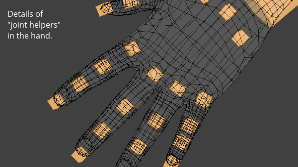
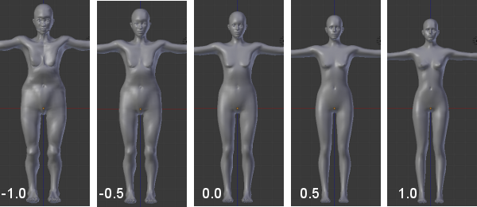
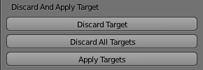
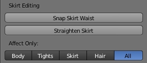

This section describes the blender version of MakeTarget. There is also a standalone version of MakeTarget.

For the information below to make sense and be useful, you will need to first install BlenderTools, see [[ Documentation:MHBlenderTools: Download and installation|MHBlenderTools: Download and installation ]]

## Introductory videos

If you find this page, this is a youtube video which might be useful:

{{#ev:youtube|X13k7H3dNHo}}

A longer and somewhat more gentle intro is provided by VScorpianC. If you're new to the subject, it will probably make sense to watch this:

{{#ev:youtube|CqH_Ec5NKNE}}

## What is a Target?  The MakeHuman Morphing Process.

 

 The principle is simple. A target is a modifcation to a base mesh shape that does not alter the mesh itself but that stores information that permits the base mesh to be transformed into the target shape using ‘morphing’.  Targets are what allow the slider controls in MakeHuman™ to take a single base mesh for a character and morph the shape of that character based on a variety of different feature target files.  The many target files used by MakeHuman™ can alter a single human base form into characters with features as different as those distinguishing male from female to as subtle as varying the shape of a single earlobe.

A target contains the offsets by which vertices of the human base model (base.obj) deviate from the original to achieve a specific feature. eg. a long nose could be a target.  These targets can be combined and MakeHuman™ uses them by blending targets together and gradually applying them to the base mesh to create a nearly endless variety of human forms.  Below are examples of target blending obtained by choosing a target that defined the character as male and combining that target with the extreme settings for other targets that determned the muscle tone or weight of the character.
  
MakeHuman™ handles morphing with a special file format, ".target".
 
## Loading the Base Mesh

 

 While it is possible to create targets using Blender without using the MakeTarget™ tool for Blender; that tool has many useful features that simplify the target creation process and will be explained by the help that follows.  Once the MakeTarget™ add-on has been enabled (see the previous "Get and Install MH Addons for Blender" section), a panel labelled MakeTarget™ version 1.xx appears in theBlender User Interface, to the right of the viewport. The visibility of the Blender User Interface can be toggled on and off with the N-key.
 

## MakeTarget 1.31

 

 Prior to loading any targets, the initial the MakeTarget™ panel consists of three main buttons. The first two buttons load the base human mesh, respectively with and without the special fitting tools. The third button labeled "Set As Base" sets an existing mesh (that must be MakeHuman™compliant and derived from the A8_v74.obj file distributed with the MakeTarget™  release within the maketarget/data/ folder) as a human base mesh.  This third option is for users that have done editing of the base mesh in another 3D modelling program and that have saved or exported the model as a Wavefront .obj file.

Loading the "Human + Fit Tools" will import the base human +mesh helpers(image below, B). The "helpers" are special geometries, used in MakeHuman™ as a reference to correctly fit clothes, hair and accessories.  These helpers can be annoying during the modelling of the character, so usually our artists first work on the pure body, loading the human only with the first button (image below, A), and then, in a successive step, they fit the helpers.
 
 

 

 

 

## Basic usage

### The MakeTarget™ Version 1.09 Panel (After Loading The Target Mesh)

 

 

After the mesh is loaded into the scene, the MakeTarget™panel layout will change, showing three new buttons that handle setting up the morphing targets. The first button creates a new empty target which will just be the original base mesh loaded in the previous step.
The second button loads the morphing from an existing target file. Do not attempt to load target files from the previous MakeHuman™versions, as these files are not compatible with the current base.
The third button creates a new target from an existing base mesh that is MakeHuman™compliant (derived from the A8_v74.obj file provided with the MakeTarget™release distribution), for example, a character modelled with an external tool (Maya, Max, C4D, etc..) and then saved or exported so that it can be imported into Blender as a wavefront obj file.  To correctly use the third button, it is necessary to first select the imported base, then the MakeHuman™ base, and then press the Load Target From Mesh button.  When the steps have been done correctly and that button is pressed the imported base will disappear and its transformations will be transferred onto the MakeHuman™ base.

 

### Editing The Target And The "Save Target As" Button

After a new empty target is initialized or an existing one is loaded/imported, the MakeTarget™ panel layout will change again, offering a rich set of new options (image below). For the basic use of the MakeTarget™ tool you may ignore all of these options except for the "Save Target As" button.
To create a custom target, the artist has to alter the base mesh, which is done in the usual way within Blender.  First start edit mode, and then select one or more vertices, moving them to reshape the mesh.  You may use the full power of Blender to create your morphing target design.The only rule, in order to create a valid morphing target, is to never add or delete a vertex, face or edge. The topology must be absolutely preserved.After the modelling process is completed, the MakeHuman™morphing target can be saved by pressing the "Save Target As" button on the MakeTarget™panel.  By default this will save all of the offset deviations of every vertice from the base mesh into the target file.

## Advanced usage

### The MakeTarget™Version 1.09 Panel (After Loading A Target)

During the creation or the editing of a target, as mentioned previously, the MakeTarget™panel shows a new layout with a rich set of options. Depending on whether the mesh is loaded without the fit tools (image below, left) or with the fit tools (image below, right), the panel offers different options.

 

 

 

 At the top of the panel there is a numeric slider that determines the amount of morphing to apply from the target. The maximum value is 1.0, which means that the target morphing is fully applied. A value of 0 will show the original base mesh without any target morphing.  The minimum value of the slider is -1.0.  Using negative values usually creates weird effects as a projected inverse of the target morph is applied, but these settings are useful to subtract unwanted morphing results when multiple targets are combined. The effect is shown in the image beginning on the left with the full inverse of the morphing target, to the original base mesh in the middle, and finally to the fully applied morph target design on the right.

 

### Load Target Section (After The First Target Is Loaded)

 

 

The three buttons now in the "Load Target" section are used in exactly the same way as they were before any target was loaded, except that any targets that are now created or loaded with these buttons become a secondary target that can be applied to the previously loaded one.  These buttons are used to append one or more additional targets to the first target and combine them in various proportions.

 

### Discard And Apply Target Section

 

 
 
The first two buttons under the "Discard And Apply Target" section will either discard all of the targets (returning you to the original base mesh) or only the last target appended (which will either be the last secondary target applied or the primary target if no secondary targets have been applied).  The button "Apply targets" under the "Discard And Apply Target" section is used to join all targets into a single unique morphing target combination.

 

### Symmetry Section

 

 

The two buttons in the "Symmetry" section are modelling tools, and are very useful.  They have been designed to produce very reliable target results. Using the symmetry buttons will cause the mesh to become symetrical on either side of the X axis, with the option to apply edits from the left side of the character to the right side (Left->Right), or vice versa (Right->Left).  Pressing these buttons will also align center vertices that have been unintentionally moved away from the center back to their center position.

 

### Save Target Section

 

 

Finally, press the "Save Target As" button to save the .target file once all secondary targets and edits have been completed.

The checkbox labeled "Selected verts only" is a very important option.  This option when checked will permit you to select a set of vertices in edit mode and then save only those vertices into the target file. Such targets are useful when you want the target to only morph the selected vertices and leave all other vertices completely unaffected by the morphing target.  For example, an artist could design a morphing target that is limited to the hands only, a single hand only, or to the head only, and save a target containing vertices that will only morph those body parts, while having no effect on other parts of the body that were not explicitly chosen by the artist.

The checkbox labeled "Active Target Only" will cause the "Save Target As" button to only save the last target only.  This option normally applies when one or more secondary targets have been added using the Load Target section after adding the initial target.

 

### Additional Fit Helper Buttons

 

 

 

 

When the fit helpers have been included as part of the target, the additional options of the MakeTarget™ panel shown in the images above appear.  These buttons are included to work with the helper objects.  When the helpers have been loaded, an additional button labeled "Fit Targets" is available under the Load Target section.  This button should be pressed after making alterations to the body that disconnect it from the helper objects, but prior to making modifications to those objects.  This button will refit the clothing to the body, and if pressed when the default All option under the "Affect Only: section is selected, all clothing helpers will be refitted to the body.  However, the refitting process will cause any modifications previously made to a refitted helper objects to be lost.  To limit the Fit Target button behavior to a single helper object, you should specify the object that you want to have refitted under the Affects Only section appearing at the bottom of the panel.  This will cause the refitting to only affect the chosen helper (for example the Hair), while leaving all other helper objects unaffected, preserving your edit modifications to those helpers (for example, the Tights and Skirt helpers will not be refitted and your modifications to those helpers will be preserved if the Hair Affects Only option is set).

The additional helper options also include buttons that improve the fit of the skirt specifically by snapping the skirt to the character's waist ("Snap Skirt Waist" button) or straightening the skirt ("Straighten Skirt" button).  It is recommended that you still select the Skirt as the Affects Only option prior to pressing either of these buttons.

 