This tutorial describes the making of the short film Running Feet with MakeHuman and MakeWalk, the mocap tool for MakeHuman characters.

The focus is on how to use the tools in the MakeWalk: Edit Actions panel to edit an animation.

<iframe frameborder# "0" height="315" src="//www.youtube.com/embed/_dbKDVd68Vg" width"420"></iframe>

The film consists of the prelude and four scenes.

## Prelude: The raw animation.

The short film starts with the original motion defined by the bvh file. This could be loaded with Blender's default, but we will use MakeWalk instead. Since MakeWalk is not part of the Blender distribution, we must first copy the makewalk folder from MakeHuman's tools/blender folder to the folder that Blender keeps its add-ons.

In Blender, enable the MakeWalk add-on from File &gt; User Preferences. In the User Preferences window, MakeWalk is found under the Addons tab, in the MakeHuman category. Enable the checkbox in the upper-right corner, next to the running man symbol. Press Save User Settings to have MakeWalk loaded every time you restart Blender.

The MakeWalk panels appear in the tool shelf whenever an armature is the active object. To load the animation, we must first enable the Detailed Steps option. A number of new buttons appear below it. Press the button at the top, Load BVH File (.bvh), and navigate to the desired bvh file in the file selector. The animation that will be used throughout this tutorial is Female1_C03_Run.bvh which is freely downloadable from ACCAD.

After a brief wait a running armature appears in the viewport. The viewport was rendered and then repeated three times in the video editor.

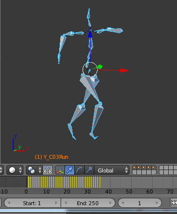

Scene 1
In the first scene the default MakeHuman character is running on a plane. The first step is to design the character in MakeHuman. Here we simple take the default character and add some simple clothes. It is imortant in MakeHuman 1.0.2 that Pose/Animate &gt; Skeleton be set to 'None'. This provides &nbsp;the rather advanced armature which is well suited for mocap. &nbsp;Name and export the character as an mhx (MakeHuman eXchange format) with the default settings.&nbsp;

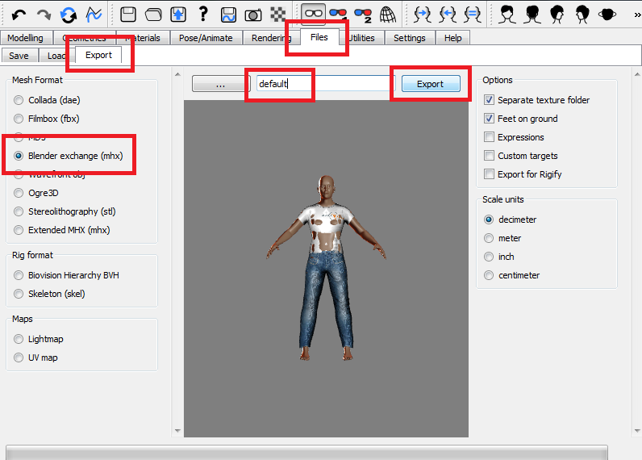

The mhx importer is bundled with Blender but not enabled by default. Enable it in the same way as you enabled MakeWalk in the previous chapter. Import the mhx file with File &gt; Import &gt; MakeHuman. The rigged character appears in the viewport.

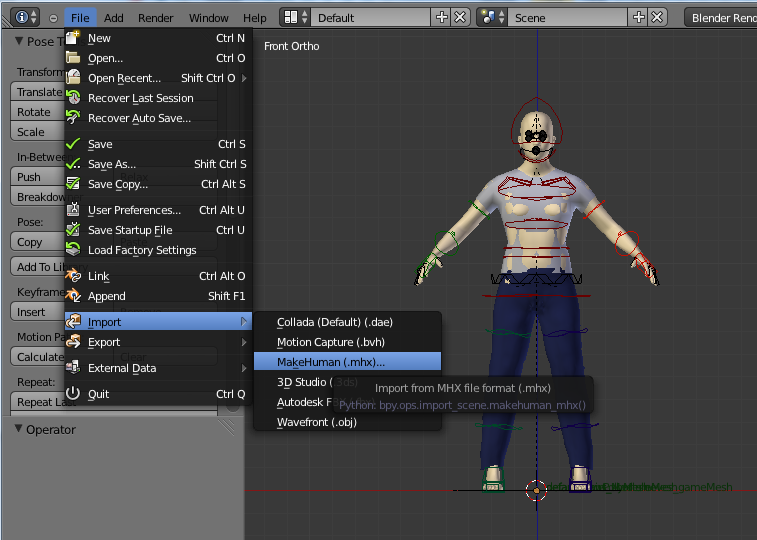

The skin pokes through the clothes at places. The simplest way to solve this problem is to delete vertices below the clothes, since the body itself will not be visible. This will also speed up performance a little.

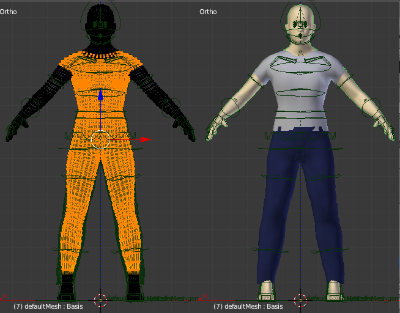

## Load and retarget

The MakeWalk user interface is located in six panels in the Tools shelf. In the Main panel, we find a single button labelled Load And Retarget. Press this button, select the same bvh file as in the previous chapter, and wait until the animation is loaded.

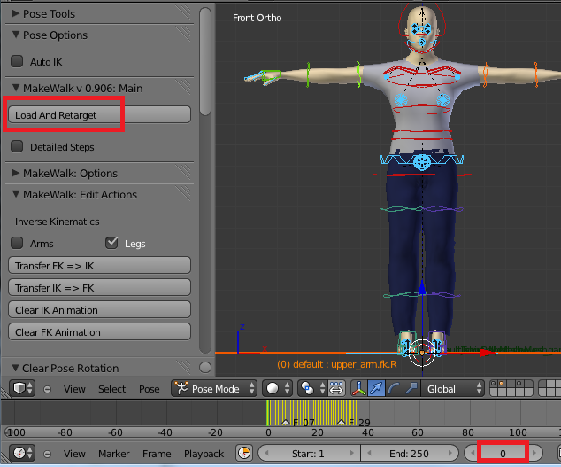

The first frame in the loaded animation is frame 1. At frame 0 the character is in T-pose. This pose is used for reference and as a part of the retargeting process.

## Fixing defects

Retargeting is never perfect, because the target armature and the original actor may have different body proportions and bone locations, or because we want the character to do something slightly different than the original bvh file. Tools for editing the action are found under the third MakeWalk panel, labelled Edit Actions. This panel is closed by default.

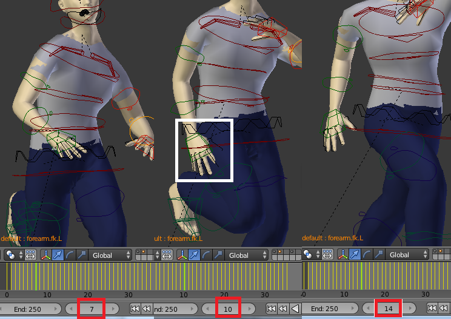

The first editing we will do is to correct a glaring defect: in frames 10 and 11 the right thumb and index finger penetrate the left thigh. We will fix this problem by adding a local shift to the right upper arm animation. This is done in the Displace Animation section.

<ol>
* Press Start Edit. The button becomes inactive and the other buttons in this section become active instead.
* Select the right upper arm, upper_arm.fk.R (the bone may have other names if you don't use the mhx advanced rig).
* Go to frame 7, where the pose is fine. Press the Rot button to insert a rotation key.
* Go forward to frame 14, where the pose is also fine. Press Rot.
* Go back to frame 10, and rotation the upper arm so there is no penetration. Press Rot.
* Scrub the timeline back and forth between frames 7 and 14, to verify that the animation looks fine.
* If the result is good, press Confirm Edit. Otherwise, continue to modify the keys. If the animation has been messed up, you can cancel the edit by pressing Undo Edit.
</ol>

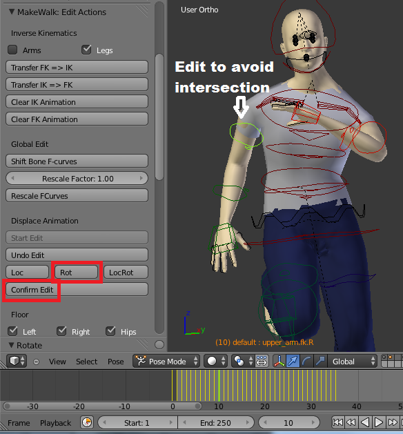

#   
Looping and repeating the animation # 

The original animation only lasts about 1.5 run cycle, but we want the character to run longer than that. Identify two frames where the character is posed similarly. There will never be a perfect match, but the poses in frames 7 and 29 are similar enough. Go to frame 7 and insert a marker on the timeline, and then go to frame 29 and do the same. The part of the animation between the markers will be repeated.

The process consists of two steps. In the Loop Animation section, the beginning and end of the specified time range are blended together. Blend Range is the number of frames used for blending, whereas the Loc and Rot options specify whether location and rotation F-curves are affected by blending. If the Loop in Place option is enabled, the average velocity is subtraced from location F-curves, making the character run in space. This is not what we want, so we leave this option unchecked.

In the Repeat Animation section, the button Repeat F-curves copies the F-curves between the two outermost selected markers. All keyframes after the second marker is lost, so make sure that you are not interested in this data.

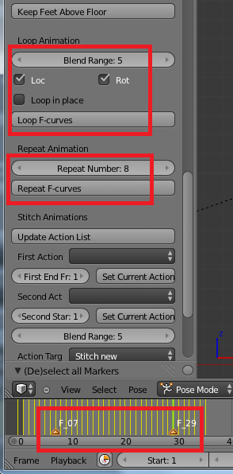

Enable the markers at frame 7 and 29 to specify the time-range to be repeated. Press Loop F-curves to smoothly blend the animation from frame 29 to frame 7. Finally set the repeat number to 8, and press Repeat F-curves. The running animation now continues until 182.

## Running on a floor

Our next goal is to give the character a floor to run on. This can be quite tricky, because when the a foot rests on the floor, it must neither sink into the floor nor float above it. Shadows give the viewer a clear visual cue where the feet are relative to the floor, so it is difficult to cheat. MakeWalk has a tool to adjust the animation to make feet stick to the floor without penetrating it.

First add a plane that acts as the floor, and scale it up so the character has something to run on.&nbsp; The character floats a small distance above the floor. The MakeWalk tool lifts up the character when some part of a foot is below the floor, but it does nothing when both feet are above it. We must therefore first move the animation down a bit.

Move to a frame where one foot is supposed to rest on the floor. Select the root bone in the hip area, and move the character down so the foot is below the floor. Then press Shift Bone F-curves in the Global Edit section, to make the shift affect the entire animation. Make sure that the markers on the timeline are deselected, because otherwise the global shift will only affect the specified time range. This is easy to forget, but fortunately easy to detect and fix. If you find that a tool only affect part of the animation, press Ctrl-Z a few times and repeat the steps with the time markers deselected.

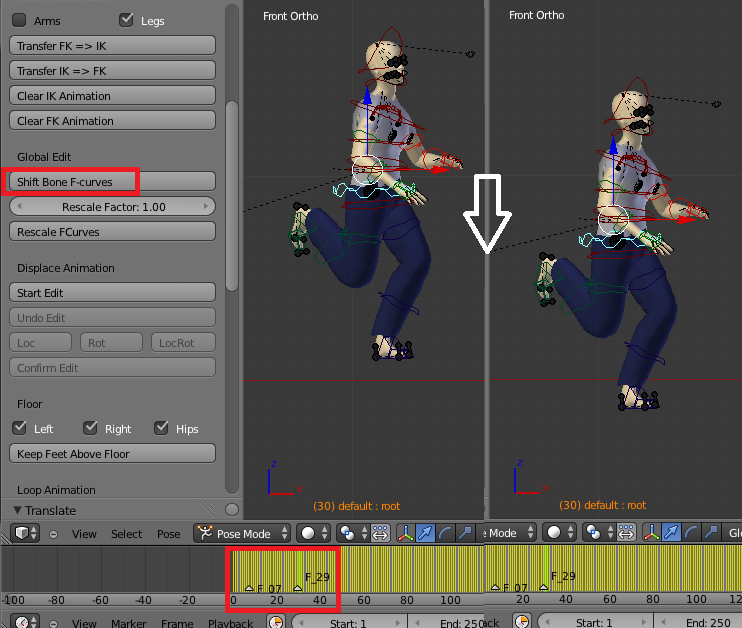

With both the plane and the root bone selected, press Keey Feet Above Floor in the Floor section. The options above this button specify which foot must stay above the ground, and whether the hips should be moved correspondingly. The Hips option should always be selected when the legs are using FK, and normally we want both the left and right foot to stay above ground. Again make sure that all time markers are deselected, because we want the feet to stay above the floor during the entire animation.

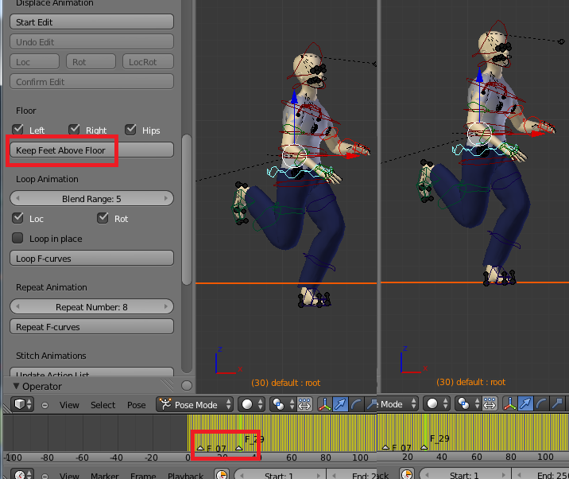

The character now runs on top of the floor, but the animation is somewhat strutty. This often happens when the hips are moved. A better result can be achieved if only the feet are moved above the floor, without affecting the hips movement. To this end, we must first transfer the animation of the FK bones to the corresponding IK bones. In the Inverse Kinematics section at the top of the Edit Actions panel, press Transfer FK =&gt; IK. The transfer process takes quite a bit of time, and you can follow the progress in the terminal window if Blender was started from there. Again make sure that no time markers are selected, because then only the animation in the specified time range is transferred.

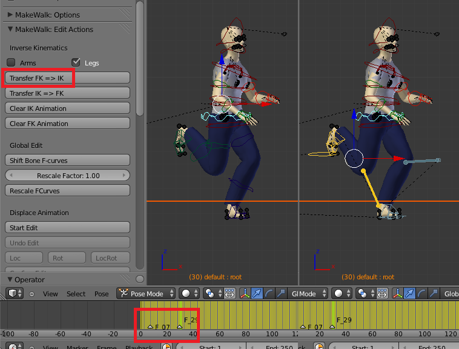

The legs are now in IK mode. Deselect the Hips option in the Floor section, and press Keep Feet Above Floor. This time the feet stay above ground, but the hips animation is unaffected.

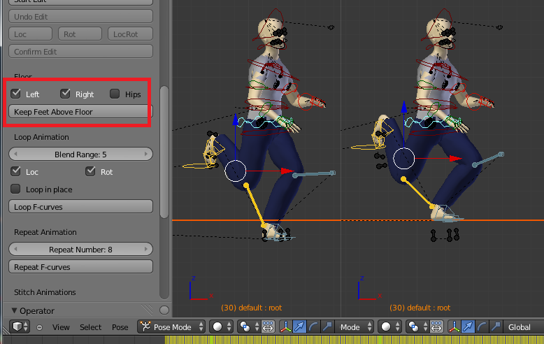

However, the result is still not what we wanted, because now the character is kneeling when he runs. We could fix that by making a global shift to the root bone F-curves. Alternatively, we can undo the last step, and move the root bone and the IK feet up before keeping the feet above floor.

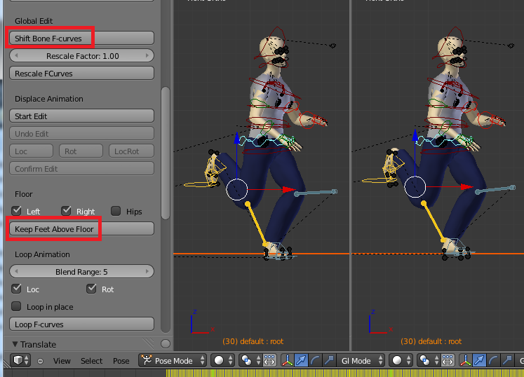

&nbsp;

Prelude &nbsp;&nbsp;&nbsp;&nbsp; Scene 2
In this scene a woman in high heels runs across a stylized hill.

Export the woman from MakeHuman as an mhx file and import her into Blender. We immediately notice that the boots look weird.

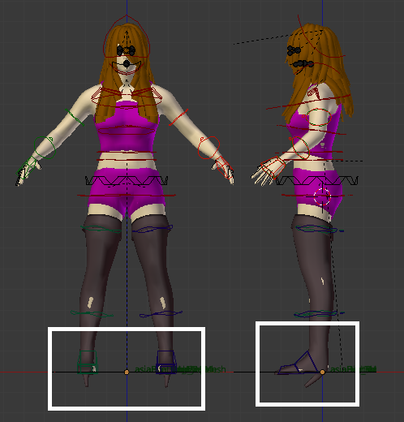

The reason is that the foot is in rest position. However, a foot inside a high-heel boot is not resting; rather, the woman should be standing on her toes inside the boot. Pose the feet correctly.

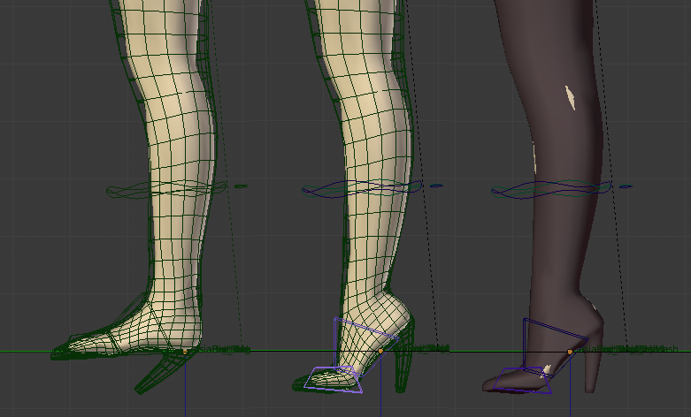

If we intend to use inverse kinematics, the IK feet must also be posed. The easiest way is to use the snapping tools available under the MHX FK/IK Switch panel in the UI shelf to the right of the viewport. The MHX panels are available when the MHX importer add-on is enabled.

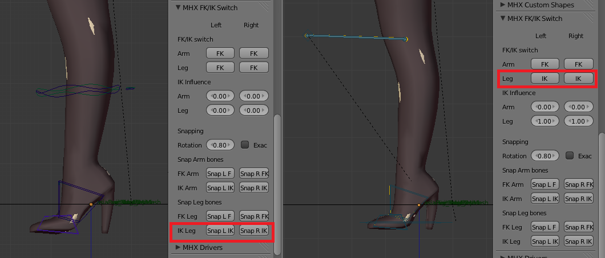

Press the Snap L IK and Snap R IK buttons at the bottom of this panel. The legs are now controlled by IK, as indicated by the buttons at the top. The IK bones become visible and the FK bones are hidden.

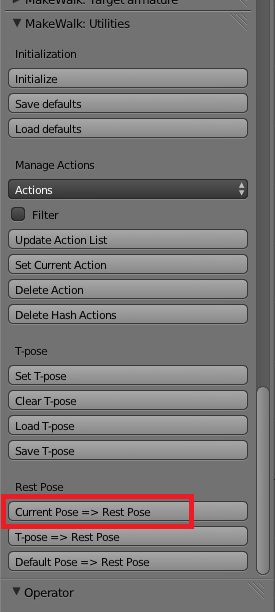

We now want to apply the current pose as rest pose. There is a standard tool to do this, but that tool will not modify the meshes using this armature properly. Instead we open the MakeWalk: Utilities panel (this is the last MakeWalk panel in the tools shelf) and press Current Pose =&gt; Rest Pose. The rest pose has now been changed.

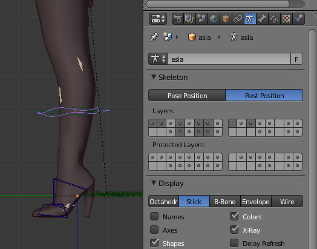

In the MHX Layers panel in the UI shelf, enable the Tweak layer (bone layer 10) and disable all other bone layers.Each foot has three marker bones which inform MakeWalk about the location of toe tip, the ball and the heel. The marker bones are placed roughly correctly by default, but since the rest pose has been changed they are now in incorrect positions.

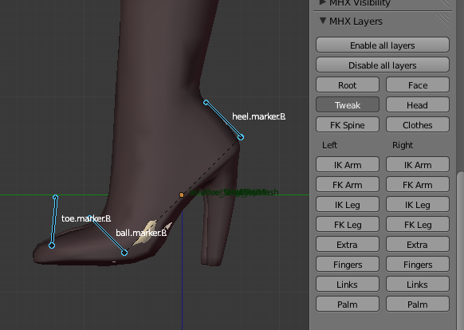

Tab into edit mode and place the marker bones correctly. Only the location of the bone heads matter; The marker bones are used for keeping the feet above a floor. The Keep Feet Above Floor will work even if the armature does not have marker bones, but not so well.

Now we are ready to create the animation. The first steps are the same as in the previous chapter. Load and retarget the bvh file, loop the animation between frames 7 and 29, and repeat the animation 10 times.

The woman will run across a stylized hill. The hill mesh can be used to keep her feet above the first, flat part of the ground, but it is of no help when it comes to the slope. This is because the MakeWalk tool keeps feet above the object location. Moreover, "above" means that the z coordinate in the object's local coordinate system is positive. Since the object center is located on global z # 0, and the local z axis coincides with the global z axis, the woman will keep running above global z 0.

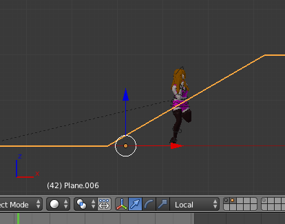

We can still use MakeWalk to keep her feet above the slope. Add a new helper plane and rotate it in object space so it coincides with the up-slope of the ground mesh. The local coordinate system is centered on the plane and the local z axis is perpendicular to it, which are the necessary requirements (error in picture).

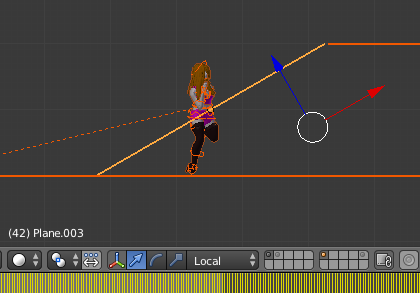

Goto the first frame where a foot should rest on the slope, namely frame 25. Delete all old time markers and create a new one here. The scrub the time slider until the character is some distance past the end of the slope and create another tíme marker. Since it takes more time to run uphill, the character should be well past the projection of the slope end at this point. More exactly, the line from the slope end to the foot should form a right angle with the slope.

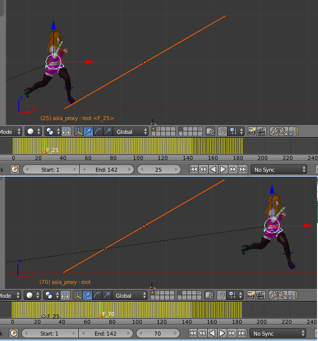

With the helper plane and a bone selected, press Keep Feet Above Floor. The woman starts running upwards, keeping her feet on the slope. Repeat the procedure for the other parts of the hill by adding addional helper planes. In the final animation, all helper planes are placed on a disabled layer and the original ground mesh is made visible.

In this case it turned out that keeping the FK feet above the planes was better than the IK feet. It also matters how far below the plane the feet are initially, because it affects whether the hips are lifted when both feet are in the air. It is usually best to start with the feet as little below the floor as possible, while they must not float above the plane anywhere where they should be planted.

&nbsp;

Scene 1&nbsp;&nbsp;&nbsp;&nbsp; Scene 3
The third scene shows a race between a baby and a fat man.

There is not so much news here. Import the two characters, load and retarget the bvh file, fix self-intersections, loop and repeat the animations, and keep feet on floor.

An adult will rapidly outpace a baby, because the location F-curves are scaled with the size of the left thigh, which is bigger for an adult than for a child. Since we want the race to be even, we need to scale the F-curves in the time direction. This is done in the Global Edit section. Select any bone in the adult character, set the rescale factor, and press Rescale FCurves. The adult now runs slower. Repeat the process with the baby, but this time choose a rescale factor greater than one. The baby runs faster.

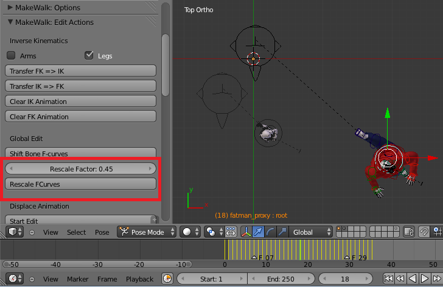

Instead of using the button in the Edit Action panel, we could simply have scaled the F-curves in the F-curve editor. This would work equally well for this animation. However, consider what happens with the cartwheel animation from ACCAD. Load and retarget the bvh file, and then scale up the F-curves with a factor two in the time direction. Between frames 140 and 142, something strange happens.

The reason is that the Y quaternion jumps from +1 to -1. There are two ways to represent the same rotation with quaternions (mathematically, SU(2) is the double cover of the rotation group SO(3)), and the rotations at frame 140 and 142 are almost the same, even though the quaternions are very different. However, the interpolated value at frame 141 is a completely different rotation, which is our problem.

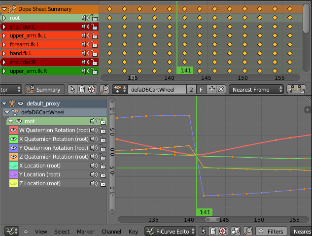

If we instead use the Rescale FCurves button with a rescale factor 2, an extra keyframe is inserted for the Y component at frame 141, making the interpolation better.

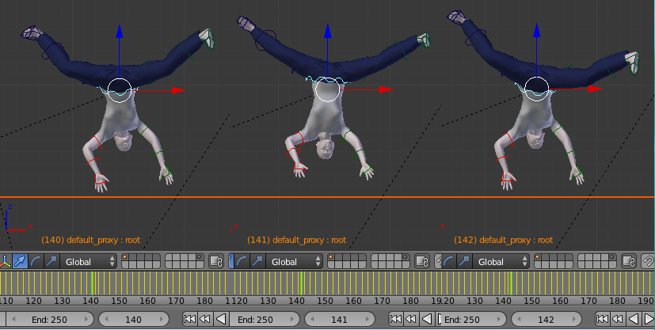

Note that the Z component does not receive an extra keyframe. This is a bug, and it is visible in the picture above.

&nbsp;

&nbsp;

Scene 2 &nbsp;&nbsp;&nbsp;&nbsp;&nbsp; Scene 4
The fourth scene shows a body-builder running in a rough terrain.

The terrain was created by subdiving a plane and giving it a displace modifier with a noise texture.

Unfortunately, it is not possible to use the Keep Feet Above Floor tool, because it only acts on the object location and rotation. Instead a second animation layer was created with the Start Edit button. For multiple keyframes, the root (hips) bone was moved in the Z direction to make the foot rest on the ground, and a keyframe was inserted with the Loc button. The animation was baked several times with the Confirm Edit button, and the process was repeated until an acceptable result was achieved.

It is a good idea to often bake the animation layer with Confirm Edit, and to create a new one with Start Edit again. Blender can become unstable if one works with an animation layer for a long time, and a crash would mean that much work is lost.

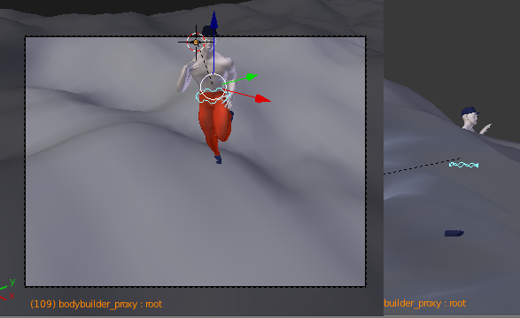

I did not have the energy to perfect the animation. E.g. at frame 109 the right foot penetrates the ground, which is most easily seen from below (although it is only what can be seen from the camera view counts). Although the problem is apparent in a still photo, it is not so easy to notice in an animation.

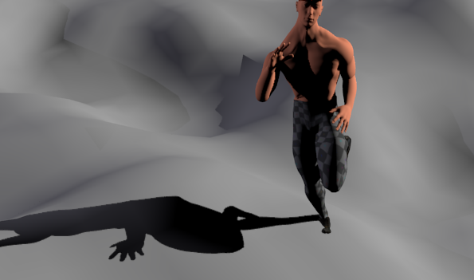

